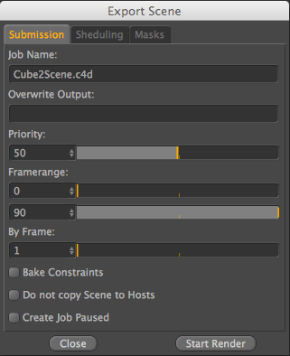
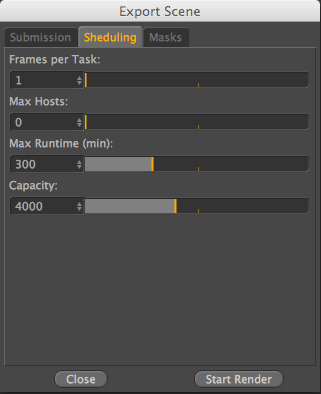
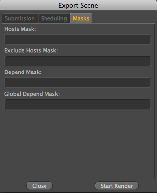

# Software intégration

## Cinema 4D

### Installation
* copier le contenu du dossier "C:\pipeline\cgru.2.3.1\plugins\c4d" dans le dossier "%appdata%\Roaming\Maxon\Maxon Cinema 4D R21_64C2B3BD\plugins"

### Afanasy Interface

#### Submission
  
> **JOB NAME : **
Afanasy job name. Default is the scene-name

> **Overwrite Output : **
	Remplace le Render-Output-Path

> **Priority : **
	Priorité dans la file d'attente de rendu (‘-1’ est la valeur par default)

> **Framerange : **
	Frame de debut et de fin de la sequence a rendre

> **By Frame : **
	Rends tout les x frames, par default la valeur est 1 donc le rendu calcul toutes les frames

> **Bake Constraints : **
	Bakes the constraints and then saves a copy of the scene which gets rendered (currently it only bakes xxx)

> **Do not copy Scene to Hosts : **
	By default it copies the scene and the textures locally to the farm and also renders the images locally. After it finished it copies then the finished renderings back to the server. If this is not wanted for some reason it can get deactivated here and it loads everything from the farm and saves directly to the farm

> **Create Job Paused : **
	The submitted job is then paused and has to be started manually

#### Scheduling
 
> **Frames per Task : **
	Number of frames in each task

> **Max Hosts : **
	Maximum number of Hosts to use (0 means to keep the default value)

> **Max Runtime (min) : **
	How long a frame is allowed to render maximum before it gets re-queued

> **Capacity : **
	Tasks capacity value

#### Masks

> **Hosts Mask : **
	Hosts names pattern where job can run on (empty value means that job can run on host with any name)

> **Exclude Hosts Mask : **
	Hosts names pattern where job can not run on

> **Depend Mask : **
	Same user jobs names pattern to wait to be done to start (empty value means not to wait any job)

> **Global Depend Mask : **
	Same as Depend Mask, but waits for a jobs from any user

> ##### règle de naming pour les mask:
> il suffit renseigner le «render name»  (visible dans le moniteur ou dans l’onglet renders de la watch)
> ou d'utiliser des expression régulières

> ##### Expressions régulières 

> examples:  
> `serveur.*` - renders qui contiennent le nom “serveur”  
> `station.*` - renders qui contiennent le nom “station”  
> `serveur05|serveur08|serveur15` ou `serveur(05|08|15)` - render 05, 08 et 15  
> `serveur(0[1-9]|1[0-9]|2[0-9]|3[0-2])` - renders 01 à 32 
