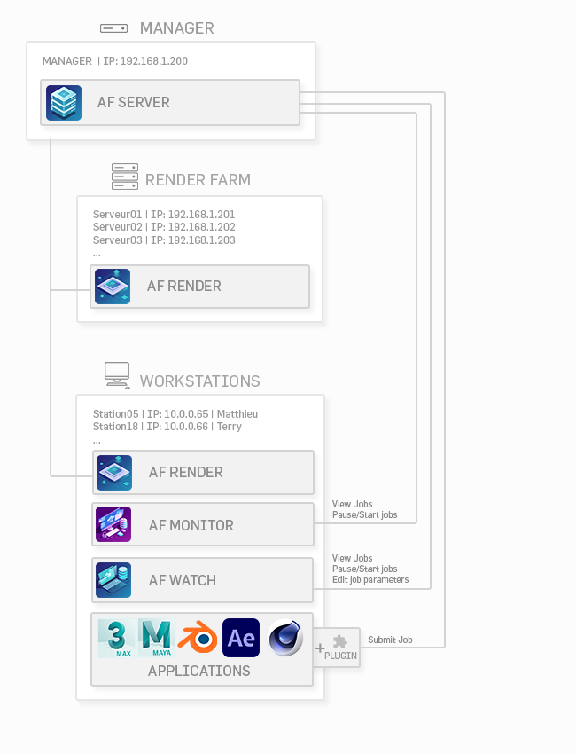
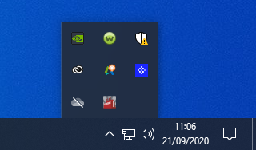
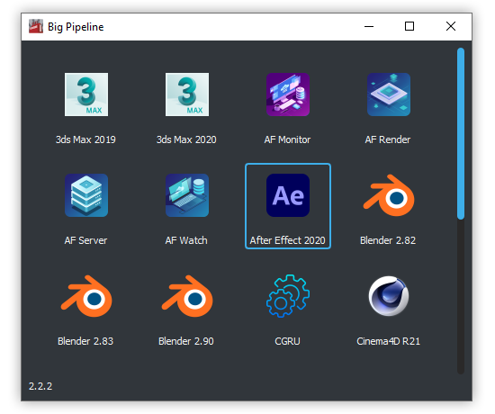

# Schema fonctionnement CGRU(Afanasy)
  

***
# Launcher Applications

L'application se lance au démarrage de l'ordinateur et se trouve en bas a droite de l'écran sous la flèche 

Pour lancer l'application manuellement il faut se rendre dans le dossier `C:\pipeline` et lancer le fichier Start_BigMenu

## Interface

!!! Info
	Pas beosin de double cliquer sur l'icône, sinon l'application va se lancer deux fois
	
## Liste des applications

|  | |
|:--:|:--:| 
| **3dsmax** | **Maya** |

|      | Description      test                          |
| ----------- | ------------------------------------ |
| `GET`       | test  |
| `PUT`       | test |
| `DELETE`    | test |